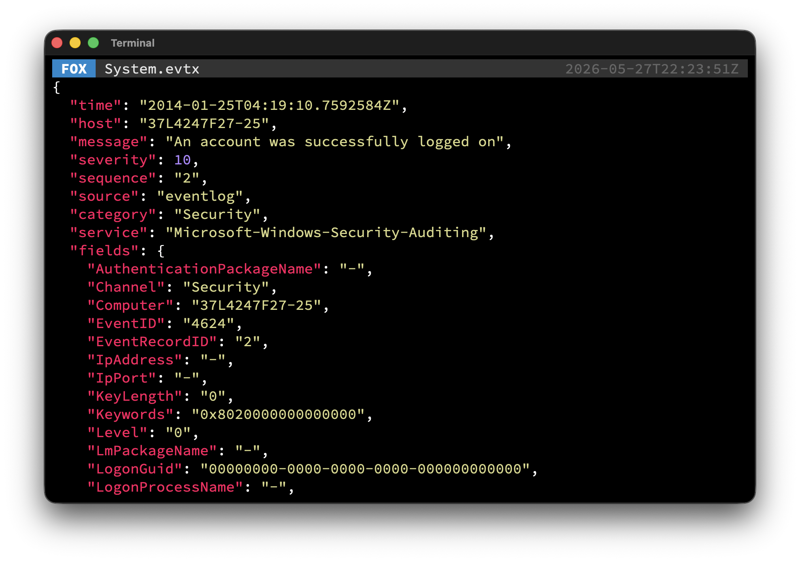

[](https://foxhunt.wtf)

The Forensic Examiners Swiss Army Knife. Providing many useful features to leverage your forensic examination process. Standalone binaries available for Windows, Linux and macOS.

[](https://goreportcard.com/report/github.com/cuhsat/fox/v4)
[](https://github.com/cuhsat/fox/actions)
[](https://github.com/cuhsat/fox/commits/main/)
[](https://github.com/cuhsat/fox/releases)



**Get it on Linux**
```bash
go install github.com/cuhsat/fox/v4@latest
```

**Get it on macOS**
```bash
brew install cuhsat/fox/fox
```

## Features
* Restricted read-only access
* [Bidirectional character](https://nvd.nist.gov/vuln/detail/CVE-2021-42574) detection
* Fast [Shannon entropy](https://en.wikipedia.org/wiki/Entropy_(information_theory)) calculation
* String carving and automatic classification
* With over 290 classes in [Hashcat](https://hashcat.net/wiki/doku.php?id=example_hashes) notation
* Dump Active Directory and other [EDB](https://learn.microsoft.com/en-us/windows/win32/extensible-storage-engine/extensible-storage-engine) files
* Dump Windows shortcut and prefetch files
* Dump [Linux ELF](https://refspecs.linuxfoundation.org/elf/elf.pdf) and [Windows PE/COFF](https://learn.microsoft.com/en-us/windows/win32/debug/pe-format) executables
* Check IPs, URLs, Domains and files via the [VirusTotal API](https://www.virustotal.com/)
* Integral `grep`, `head`, `tail`, `hexdump`, `wc` like abilities
* Integral syntax highlighting for many different formats
* Integral *Chain-of-Custody* receipt generation
* Many popular archive and compression formats
* Many popular cryptographic, fuzzy, image and fast hashes
* Complete with [man pages](assets/man) for every mode
* Special Hunt mode
  * Built-in support for [EnCase EWF](https://www.loc.gov/preservation/digital/formats/fdd/fdd000408.shtml) and raw `dd` images
  * Built-in log carving of [Linux Journals](https://systemd.io/JOURNAL_FILE_FORMAT/) and [Windows Event Logs](https://learn.microsoft.com/en-us/windows/win32/eventlog/event-log-file-format)
  * Built-in super timeline in [Common Event Format](https://www.microfocus.com/documentation/arcsight/arcsight-smartconnectors-8.3/cef-implementation-standard/Content/CEF/Chapter%201%20What%20is%20CEF.htm)
  * Built-in translation of over 51600 event ids
  * Built-in warning of critical system events
  * Filter events with [Sigma Rules](https://sigmahq.io/) syntax
  * Filter anomalies using [Levenshtein distance](https://en.wikipedia.org/wiki/Levenshtein_distance)
  * Stream in [Splunk HEC](https://help.splunk.com/en/splunk-enterprise/leverage-rest-apis/rest-api-reference/10.0/input-endpoints/input-endpoint-descriptions) and [Elastic ECS](https://www.elastic.co/docs/reference/ecs) format
  * Save as `JSON`, `JSON Lines` or `SQLite3`

## Examples

Find occurrences in event logs:
```bash
$ fox -eWinlogon ./**/*.evtx
```

Show MBR in canonical hex:
```bash
$ fox hex -hc512 disk.bin
```

List high entropy files:
```bash
$ fox list -n0.9 ./**/*
```

Show strings in binary:
```bash
$ fox text -w ioc.exe
```

Test a suspicious file:
```bash
$ fox test ioc.exe
```

Hash archive contents:
```bash
$ fox hash -uTLSH files.7z
```

Hunt down suspicious events:
```bash
$ fox hunt -sv ./**/*.E01
```

## Supports
File Formats
> evtx, journal, json, jsonl, lnk, pf, ELF, ESE/EDB, PE/COFF

Image Formats
> EWF-E01, EWF-S01, raw

Archive Formats
> 7zip, ar, CAB, CPIO, ISO, RAR, RPM, tar, xar, ZIP

Compression Formats
> Brotli, bzip2, gzip, Kanzi, lz4, lzip, lzma, LZFSE, LZO, LZVN, LZW, LZX, MinLZ, S2, Snappy, xz, zlib, zstd

Cryptographic Hashes
> BLAKE2S-256, BLAKE2B-256, BLAKE2B-384, BLAKE2B-512, BLAKE3-256, BLAKE3-512, HAS-160, MD2, MD4, MD5, MD6, RIPEMD-160, SHAKE128, SHAKE256, SHA1, SHA224, SHA256, SHA512, SHA3, SHA3-224, SHA3-256, SHA3-384, SHA3-512, SM3, Whirlpool

Performance Hashes
> FNV-1, FNV-1a, Murmur3, SipHash, XXH32, XXH64, XXH3

Similarity Hashes
> ImpHash, SSDeep, TLSH

Windows Specific
> LM, NT, PE Checksum  

Image Specific
> aHash, dHash, pHash

Checksums
> Adler32, Fletcher-4, CRC32-C, CRC32-IEEE, CRC64-ECMA, CRC64-ISO

---

*Disclaimer: This code was developed without the use of AI tooling and therefor does not contain any AI generated code, test or documentation. Furthermore, this code does not contain, employ or utilize AI tools in any other form. All data processed will not be shared with third parties except otherwise explicitly stated and permitted by the user.*

---
🦊 is released under the [GPL-3.0](LICENSE.md)