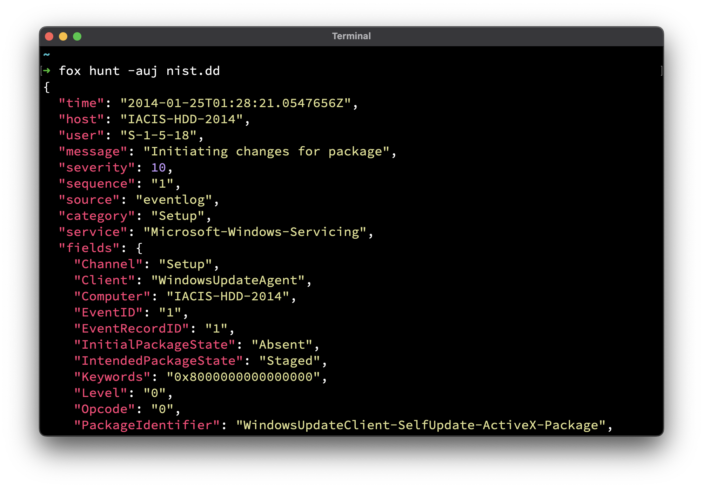

<div align="center">
  
  <br/><br/>The Forensic Examiners Swiss Army Knife<br/><br/>

  [](https://goreportcard.com/report/github.com/cuhsat/fox/v4)
  [](https://github.com/cuhsat/fox/actions)
  [](https://github.com/cuhsat/fox/releases)

  
</div>

## Synopsis
Fox is a CLI tool, build to support the examination process of file based forensic artifacts, by providing the most useful features in a cross-platform standalone binary. All files will only be processed read-only. A Chain-of-Custody receipt is generated upon every output.

## Features
* [x] Restricted read-only access
* [x] [Bidirectional character](https://nvd.nist.gov/vuln/detail/CVE-2021-42574) detection
* [x] String carving and automatic classification
* [x] With over 290 classes in [Hashcat](https://hashcat.net/wiki/doku.php?id=example_hashes) notation
* [x] Parse Fortinet binary firewall log files
* [x] Parse Active Directory and other [EDB](https://learn.microsoft.com/en-us/windows/win32/extensible-storage-engine/extensible-storage-engine) files
* [x] Parse Windows shortcut and prefetch files
* [x] Parse [Linux ELF](https://refspecs.linuxfoundation.org/elf/elf.pdf) and [Windows PE/COFF](https://learn.microsoft.com/en-us/windows/win32/debug/pe-format) executables
* [x] Check IPs, URLs, Domains and files via [VirusTotal API](https://www.virustotal.com/)
* [x] Extract NTLM hashes from [Active Directory](https://learn.microsoft.com/en-us/troubleshoot/windows-server/windows-security/ntlm-user-authentication) databases
* [x] Integral full [MCP](https://modelcontextprotocol.io/docs/getting-started/intro) streaming server for AI agents
* [x] Integral `grep`, `head`, `tail`, `uniq`, `wc`, `hexdump` like abilities
* [x] Integral syntax highlighting for many different formats
* [x] Integral fast [Shannon entropy](https://en.wikipedia.org/wiki/Entropy_(information_theory)) calculation
* [x] Integral *Chain-of-Custody* receipt generation
* [x] Many popular archive and compression formats
* [x] Many popular cryptographic, image, fuzzy and fast hashes
* [x] With [man pages](assets/man) for every mode
* [x] Special [Hunt](assets/man/fox-hunt.md) mode
  * [x] Built-in log carving of [Linux Journals](https://systemd.io/JOURNAL_FILE_FORMAT/) and [Windows Event Logs](https://learn.microsoft.com/en-us/windows/win32/eventlog/event-log-file-format)
  * [x] Built-in super timeline in [Common Event Format](https://www.microfocus.com/documentation/arcsight/arcsight-smartconnectors-8.3/cef-implementation-standard/Content/CEF/Chapter%201%20What%20is%20CEF.htm)
  * [x] Built-in translation of over 51600 event ids
  * [x] Built-in warning of critical system events
  * [x] Filter events with [Sigma Rules](https://sigmahq.io/) syntax
  * [x] Filter anomalies using [Levenshtein distance](https://en.wikipedia.org/wiki/Levenshtein_distance)
  * [x] Stream in [Splunk HEC](https://help.splunk.com/en/splunk-enterprise/leverage-rest-apis/rest-api-reference/10.0/input-endpoints/input-endpoint-descriptions) and [Elastic ECS](https://www.elastic.co/docs/reference/ecs) format
  * [x] Save as `JSON`, `JSON Lines`, `Parquet` or `SQLite` 

## Install
The fastest way to get started, is to use the `go install` command:

```console
go install github.com/cuhsat/fox/v4@latest
```

There are also standalone binaries available:

|   OS    | Binaries                                                                                                                                                                       | Packages                                                                                                                                                                                                                                                                                                                                                 |
|:-------:|:-------------------------------------------------------------------------------------------------------------------------------------------------------------------------------|:---------------------------------------------------------------------------------------------------------------------------------------------------------------------------------------------------------------------------------------------------------------------------------------------------------------------------------------------------------|
|  Linux  | [amd](https://github.com/cuhsat/fox/releases/latest/download/fox_linux_amd64.tar.gz) \| [arm](https://github.com/cuhsat/fox/releases/latest/download/fox_linux_arm64.tar.gz)   | [apk](https://github.com/cuhsat/fox/releases/latest/download/fox_linux_amd64.apk) \| [deb](https://github.com/cuhsat/fox/releases/latest/download/fox_linux_amd64.deb) \| [pkg](https://github.com/cuhsat/fox/releases/latest/download/fox_linux_amd64.pkg.tar.zst) \| [rpm](https://github.com/cuhsat/fox/releases/latest/download/fox_linux_amd64.rpm) |
|  macOs  | [amd](https://github.com/cuhsat/fox/releases/latest/download/fox_darwin_amd64.tar.gz) \| [arm](https://github.com/cuhsat/fox/releases/latest/download/fox_darwin_arm64.tar.gz) | `brew install cuhsat/fox/fox`                                                                                                                                                                                                                                                                                                                            |
| Windows | [amd](https://github.com/cuhsat/fox/releases/latest/download/fox_windows_amd64.zip) \| [arm](https://github.com/cuhsat/fox/releases/latest/download/fox_windows_arm64.zip)     | Binaries are Portable Executables                                                                                                                                                                                                                                                                                                                        |

## Examples

Find occurrences in event logs:
```console
fox -eWinlogon ./**/*.evtx
```

Show MBR in canonical hex:
```console
fox hex -Chc512 disk.dd
```

Show strings in binary:
```console
fox text -w ioc.exe
```

Hash archive contents:
```console
fox hash -Amd5 files.7z
```

List high entropy files:
```console
fox stat -n0.8 ./**/*
```

Dump NTLM hashes:
```console
fox dump system ntds.dit
```

Test a suspicious file:
```console
fox test ioc.exe
```

Hunt down suspicious events:
```console
fox hunt -u *.dd
```

## Supports
File Formats
> evtx, journal, json, jsonl, lnk, pf, ELF, ESE/EDB, PE/COFF

Archive Formats
> 7zip, ar, CAB, CPIO, ISO, MSI, RAR, RPM, tar, xar, ZIP

Compression Formats
> BGZF, Brotli, bzip2, gzip, Kanzi, lz4, lzip, lzma, LZFSE, LZO, LZVN, LZW, LZX, MinLZ, S2, Snappy, xz, zlib, zstd

Cryptographic Hashes
> BLAKE2S-256, BLAKE2B-256, BLAKE2B-384, BLAKE2B-512, BLAKE3-256, BLAKE3-512, GOST2012-256, GOST2012-512, HAS-160, LSH-256, LSH-512, MD2, MD4, MD5, MD6, RIPEMD-160, SHAKE128, SHAKE256, SHA1, SHA224, SHA256, SHA512, SHA3, SHA3-224, SHA3-256, SHA3-384, SHA3-512, Skein-224, Skein-256, Skein-384, Skein-512, SM3, Whirlpool

Performance Hashes
> FNV-1, FNV-1a, Murmur3, RapidHash, SipHash, XXH32, XXH64, XXH3

Perceptual Hashes
> Average, Difference, Median, PHash, WHash, MarrHildreth, BlockMean, PDQ, RASH

Similarity Hashes
> ImpFuzzy, ImpHash, ImpHash0, SSDeep, TLSH

Windows Specific
> LM, NT, PE Checksum

Checksums
> Adler32, Fletcher4, CRC16-CCITT, CRC32-C, CRC32-IEEE, CRC64-ECMA, CRC64-ISO

---
🦊 is released under the [GPL-3.0](LICENSE.md)
